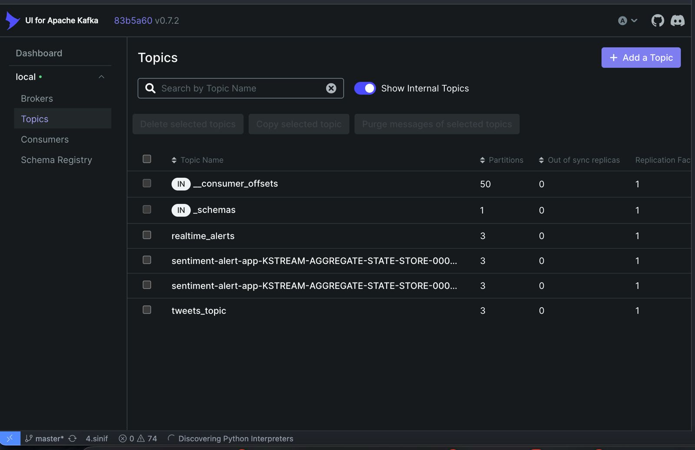
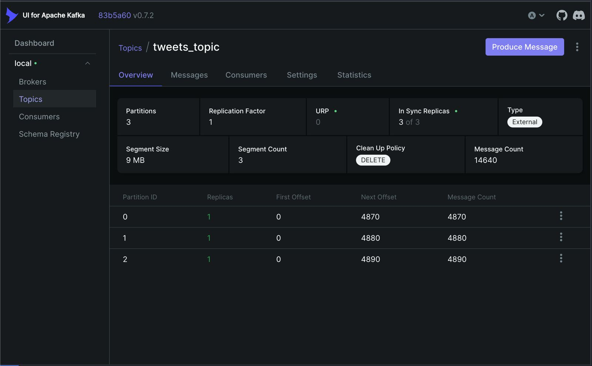
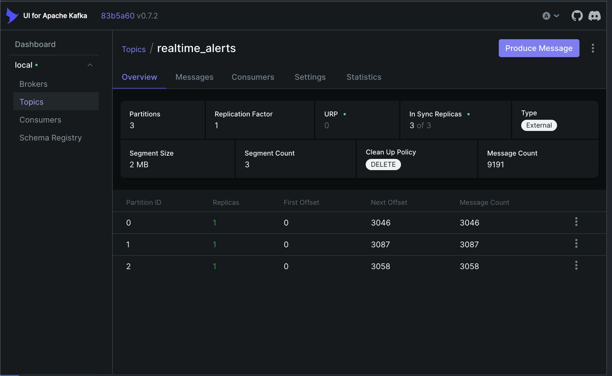
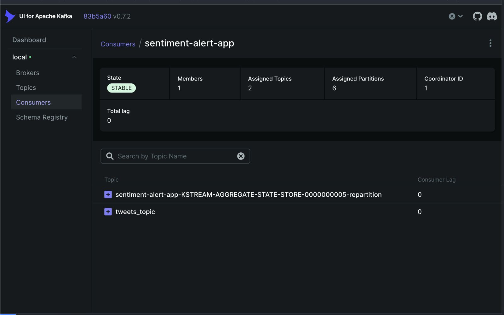
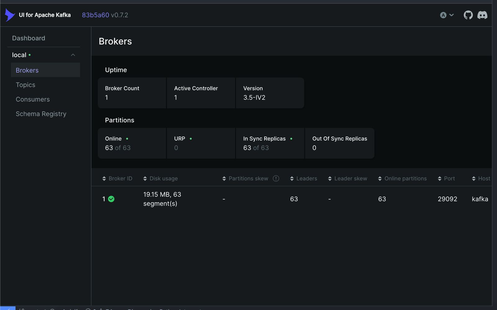
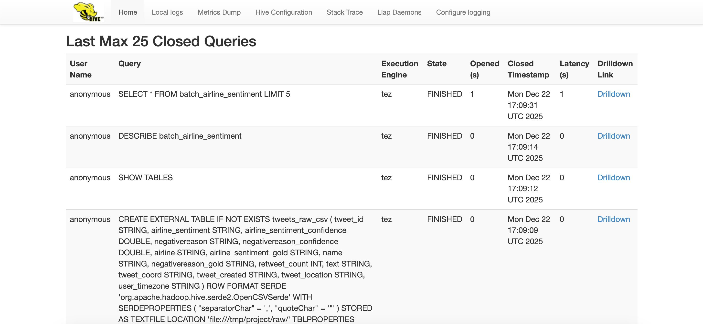

# 📚 Twitter Airline Sentiment Analysis - Proje Dokümantasyonu

## 📋 İçindekiler

1. [Proje Özeti](#proje-özeti)
2. [Sistem Mimarisi ve Akış](#sistem-mimarisi-ve-akış)
3. [Kullanılan Teknolojiler ve Terimler](#kullanılan-teknolojiler-ve-terimler)
4. [Proje Adımları (Baştan Sona)](#proje-adımları-baştan-sona)
5. [Kafka Dashboard Screenshot Rehberi](#kafka-dashboard-screenshot-rehberi)
6. [Sonuçlar ve Analiz](#sonuçlar-ve-analiz)

---

## 🎯 Proje Özeti

Bu proje, **Lambda Architecture** (Lambda Mimarisi) kullanarak Twitter havayolu sentiment verilerini hem **batch** (toplu) hem de **stream** (gerçek zamanlı) olarak işleyen bir yüksek performanslı veri işleme pipeline'ıdır.

### Projenin Amacı

- **Batch Processing**: Tüm tarihsel verileri analiz ederek havayollarına göre sentiment istatistikleri çıkarmak
- **Stream Processing**: Gerçek zamanlı olarak negatif tweet'leri tespit edip uyarı üretmek
- **Data Catalog**: Apache Hive kullanarak tüm verileri SQL ile sorgulanabilir hale getirmek

### Seçilen Track

**Track 2A: Apache Kafka Ecosystem**
- Kafka Streams ile gerçek zamanlı işleme
- Kafka Connect HDFS Sink ile veri kalıcılığı
- Use Case A: Real-Time Airline Complaint Alerting

---

## 🏗️ Sistem Mimarisi ve Akış

### Lambda Architecture Genel Bakış

```
┌─────────────────────────────────────────────────────────────────┐
│                    LAMBDA ARCHITECTURE                          │
└─────────────────────────────────────────────────────────────────┘

                    ┌──────────────┐
                    │  Tweets.csv  │
                    │  (Kaggle)    │
                    └──────┬───────┘
                           │
        ┌──────────────────┴──────────────────┐
        │                                      │
        │ BATCH PATH              STREAM PATH │
        │                                      │
        ▼                                      ▼
┌───────────────┐                    ┌──────────────────┐
│               │                    │                  │
│ Kafka Producer│                    │ Kafka Producer   │
│   (Python)    │                    │   (Python)       │
│               │                    │                  │
└───────┬───────┘                    └────────┬─────────┘
        │                                      │
        │                                      │
        ▼                                      ▼
┌───────────────┐                    ┌──────────────────┐
│               │                    │                  │
│  tweets_topic │                    │  tweets_topic    │
│  (Kafka)      │                    │   (Kafka)        │
│               │                    │                  │
└───────┬───────┘                    └────────┬─────────┘
        │                                      │
        │                                      │
        ▼                                      ▼
┌───────────────┐                    ┌──────────────────┐
│               │                    │                  │
│ Apache Spark  │                    │ Kafka Streams    │
│ (Batch Job)   │                    │ (Real-time)      │
│               │                    │                  │
└───────┬───────┘                    └────────┬─────────┘
        │                                      │
        │                                      │
        ▼                                      ▼
┌───────────────┐                    ┌──────────────────┐
│               │                    │                  │
│ Parquet Files │                    │ Console Alerts + │
│ (output/)     │                    │ realtime_alerts  │
│               │                    │   (Kafka Topic)  │
└───────┬───────┘                    └──────────────────┘
        │
        │
        ▼
┌───────────────┐
│               │
│ Apache Hive   │
│ (Data Catalog)│
│               │
└───────────────┘
```

### Veri Akışı

1. **Veri Kaynağı**: Kaggle'dan indirilen `Tweets.csv` dosyası (14,640 tweet)
2. **Stream Simülasyonu**: Python Kafka Producer, CSV'yi satır satır okuyup Kafka'ya gönderir
3. **Batch İşleme**: Spark, CSV'yi direkt okuyup toplu analiz yapar
4. **Stream İşleme**: Kafka Streams, Kafka topic'inden gerçek zamanlı okur ve negatif tweet'leri filtreler
5. **Sonuçlar**:
   - Batch: Parquet formatında havayolu başına sentiment istatistikleri
   - Stream: Konsola yazdırılan uyarılar ve `realtime_alerts` topic'ine yazılan mesajlar

---

## 🔧 Kullanılan Teknolojiler ve Terimler

### 1. Apache Kafka

**Tanım**: Dağıtık, yüksek performanslı, gerçek zamanlı veri akışı (streaming) platformu.

**Kullanım Amacı**:
- Mesaj broker olarak kullanılır
- Producer'lar veri gönderir, Consumer'lar veri okur
- Topic'ler üzerinden veri organizasyonu yapılır

**Temel Terimler**:
- **Topic**: Mesajların kategorilere ayrıldığı kanallar (örn: `tweets_topic`)
- **Partition**: Topic'in parçalara bölünmesi (paralel işleme için)
- **Producer**: Veri gönderen uygulama
- **Consumer**: Veri okuyan uygulama
- **Broker**: Kafka sunucusu
- **Offset**: Mesajın topic içindeki pozisyonu

**Projede Kullanımı**:
- `tweets_topic`: Ham tweet verileri
- `realtime_alerts`: Negatif sentiment uyarıları

### 2. Apache Kafka Streams

**Tanım**: Kafka üzerinde stream processing yapmak için geliştirilmiş Java kütüphanesi.

**Özellikler**:
- Kafka cluster'ına gömülü çalışır (ayrı cluster gerekmez)
- Düşük latency (gecikme)
- Stateful ve stateless işlemler destekler
- Windowing (pencereleme) desteği

**Projede Kullanımı**:
- `SentimentAlertApp`: Negatif tweet'leri filtreler ve uyarı üretir
- Gerçek zamanlı işleme yapar
- Konsola uyarı yazdırır ve `realtime_alerts` topic'ine yazar

**Temel Terimler**:
- **KStream**: Key-value çiftlerinden oluşan sürekli veri akışı
- **KTable**: Güncellenebilir tablo (stateful işlemler için)
- **Topology**: Stream processing işlemlerinin grafiği
- **Serde**: Serializer/Deserializer (veri formatı dönüşümü)

### 3. Apache Spark

**Tanım**: Büyük veri setleri üzerinde dağıtık, yüksek performanslı batch processing framework'ü.

**Özellikler**:
- In-memory processing (bellekte işleme)
- Resilient Distributed Dataset (RDD) ve DataFrame API'leri
- SQL sorguları yapılabilir
- Machine learning desteği

**Projede Kullanımı**:
- `spark_batch_job.py`: Tüm CSV'yi okuyup havayolu başına sentiment analizi yapar
- Aggregation (toplama) işlemleri yapar
- Sonuçları Parquet formatında kaydeder

**Temel Terimler**:
- **SparkSession**: Spark uygulamasının giriş noktası
- **DataFrame**: Tablo benzeri veri yapısı
- **Transformation**: Veri dönüşümü (lazy evaluation)
- **Action**: Sonuç üreten işlem (execution tetikler)
- **Partition**: Verinin parçalara bölünmesi

### 4. Apache Zookeeper

**Tanım**: Dağıtık sistemler için koordinasyon servisi.

**Kullanım Amacı**:
- Kafka cluster'ının koordinasyonu
- Broker'ların durumunu takip eder
- Topic metadata'sını saklar

**Projede Kullanımı**:
- Docker Compose ile otomatik başlatılır
- Kafka'nın çalışması için gereklidir

### 5. Schema Registry

**Tanım**: Kafka mesajlarının şemalarını (schema) yöneten servis.

**Kullanım Amacı**:
- Avro formatındaki mesajların şemalarını saklar
- Şema evrimini (schema evolution) yönetir
- Veri uyumluluğunu sağlar

**Projede Kullanımı**:
- Kafka Connect HDFS Sink için şema yönetimi
- Port 8081'de çalışır

### 6. Kafka UI

**Tanım**: Kafka cluster'ını görselleştirmek ve yönetmek için web arayüzü.

**Kullanım Amacı**:
- Topic'leri görüntüleme
- Mesajları okuma
- Consumer group'ları izleme
- Cluster metriklerini görüntüleme

**Erişim**: http://localhost:8080

### 7. Apache Hive

**Tanım**: Hadoop üzerinde SQL benzeri sorgular yapmayı sağlayan data warehouse yazılımı.

**Kullanım Amacı**:
- HDFS'teki verileri SQL ile sorgulama
- Schema tanımlama
- Data catalog görevi görme

**Projede Kullanımı**:
- `tweets_raw_csv`: Ham CSV verileri
- `tweets_stream_avro`: Stream'den gelen Avro verileri
- `batch_airline_sentiment`: Batch sonuçları (Parquet)

### 8. Parquet

**Tanım**: Kolon bazlı (columnar) veri formatı.

**Avantajları**:
- Yüksek sıkıştırma oranı
- Hızlı okuma/yazma
- Spark ile native entegrasyon

**Projede Kullanımı**:
- Batch sonuçları Parquet formatında kaydedilir
- `output/batch_results_parquet/` klasöründe

### 9. Avro

**Tanım**: Binary serialization formatı, şema ile birlikte kullanılır.

**Avantajları**:
- Kompakt binary format
- Şema evrimi desteği
- Kafka ile iyi entegrasyon

**Projede Kullanımı**:
- Stream verilerinin HDFS'e yazılması için (Kafka Connect HDFS Sink)

### 10. Lambda Architecture

**Tanım**: Hem batch hem de stream processing'i birleştiren mimari pattern.

**Bileşenler**:
- **Batch Layer**: Tüm veriyi işler, doğru sonuçlar üretir (Spark)
- **Speed Layer**: Gerçek zamanlı veriyi işler, hızlı sonuçlar üretir (Kafka Streams)
- **Serving Layer**: Her iki katmandan gelen sonuçları birleştirir (Hive)

**Avantajları**:
- Doğruluk ve hızı birleştirir
- Fault tolerance (hata toleransı)
- Ölçeklenebilirlik

---

## 📝 Proje Adımları (Baştan Sona)

### Adım 1: Ortam Hazırlığı

**Yapılanlar**:
1. Python 3.12.2 kurulumu kontrol edildi
2. Java 17 kurulumu (Spark için gerekli)
3. Maven 3.9.9 kurulumu kontrol edildi
4. Docker Desktop kurulumu ve çalıştırılması

**Komutlar**:
```bash
# Python virtual environment oluşturma
python3 -m venv venv
source venv/bin/activate
pip install -r requirements.txt
```

### Adım 2: Veri Hazırlığı

**Yapılanlar**:
1. Kaggle'dan `Tweets.csv` dosyası indirildi
2. Dosya `data/Tweets.csv` konumuna yerleştirildi
3. Toplam 14,640 tweet içeriyor

**Veri Şeması**:
- `tweet_id`: Tweet'in benzersiz ID'si
- `airline_sentiment`: Sentiment değeri (positive, negative, neutral)
- `airline`: Havayolu adı (United, US Airways, American, Southwest, Delta, Virgin America)
- `text`: Tweet içeriği
- `retweet_count`: Retweet sayısı
- `tweet_created`: Tweet oluşturulma zamanı

### Adım 3: Kafka Ortamının Başlatılması

**Yapılanlar**:
1. Docker Compose ile Kafka servisleri başlatıldı:
   - Zookeeper (Port 2181)
   - Kafka Broker (Port 9092)
   - Schema Registry (Port 8081)
   - Kafka UI (Port 8080)

**Komutlar**:
```bash
docker-compose up -d
```

**Kontrol**:
```bash
docker ps  # Tüm servislerin çalıştığını kontrol et
```

### Adım 4: Kafka Topic'lerinin Oluşturulması

**Yapılanlar**:
1. `tweets_topic`: 3 partition, 1 replication factor
2. `realtime_alerts`: 3 partition, 1 replication factor

**Komutlar**:
```bash
./scripts/create_topics.sh
```

**Topic Detayları**:
- **tweets_topic**: Ham tweet verilerini içerir
- **realtime_alerts**: Negatif sentiment uyarılarını içerir

### Adım 5: Java Uygulamasının Build Edilmesi

**Yapılanlar**:
1. Maven ile Java projesi build edildi
2. Kafka Streams bağımlılıkları indirildi
3. JAR dosyası oluşturuldu: `target/twitter-sentiment-analysis-1.0.0.jar`

**Komutlar**:
```bash
./scripts/build_java.sh
# veya
mvn clean package -DskipTests
```

**Oluşturulan Dosyalar**:
- `Tweet.java`: Tweet veri modeli
- `TweetSerde.java`: Kafka Serde (Serializer/Deserializer)
- `SentimentAlertApp.java`: Ana Kafka Streams uygulaması

### Adım 6: Kafka Streams Uygulamasının Başlatılması

**Yapılanlar**:
1. `SentimentAlertApp` başlatıldı
2. `tweets_topic`'ten mesajları okumaya başladı
3. Negatif sentiment'li tweet'leri filtreler
4. Konsola uyarı yazdırır
5. `realtime_alerts` topic'ine yazar

**Komutlar**:
```bash
./scripts/run_streams_app.sh
```

**Çalışma Mantığı**:
```java
// Negatif tweet'leri filtrele
tweetsStream
    .filter((key, tweet) -> "negative".equalsIgnoreCase(tweet.getAirlineSentiment()))
    .mapValues((tweet) -> {
        // Konsola uyarı yazdır
        System.out.println("🚨 NEGATIVE SENTIMENT DETECTED!");
        // Topic'e yaz
        return alertMessage;
    });
```

### Adım 7: Kafka Producer'ın Çalıştırılması

**Yapılanlar**:
1. Python script'i `Tweets.csv`'yi okur
2. Her satırı JSON formatına çevirir
3. `tweets_topic`'e gönderir
4. 100ms gecikme ile gerçekçi simülasyon yapar

**Komutlar**:
```bash
./scripts/run_producer.sh
```

**Çalışma Mantığı**:
```python
# CSV'yi oku
with open('data/Tweets.csv', 'r') as file:
    reader = csv.DictReader(file)
    for row in reader:
        # JSON'a çevir
        tweet_json = json.dumps(row)
        # Kafka'ya gönder
        producer.send('tweets_topic', value=tweet_json)
        # 100ms bekle
        time.sleep(0.1)
```

### Adım 8: Spark Batch Job'ının Çalıştırılması

**Yapılanlar**:
1. Spark session oluşturuldu
2. `Tweets.csv` dosyası okundu
3. Havayolu başına sentiment aggregation yapıldı:
   - Toplam tweet sayısı
   - Positive count
   - Negative count
   - Neutral count
   - Negative ratio (negative_count / total_tweets)
4. Sonuçlar Parquet formatında kaydedildi

**Komutlar**:
```bash
export JAVA_HOME=/opt/homebrew/opt/openjdk@17/libexec/openjdk.jdk/Contents/Home
./scripts/run_spark_job.sh
```

**Spark İşlemleri**:
```python
# Veriyi oku
df = spark.read.csv('data/Tweets.csv', header=True, schema=schema)

# Aggregation yap
result = df.groupBy('airline').agg(
    count('*').alias('total_tweets'),
    sum(when(col('airline_sentiment') == 'positive', 1)).alias('positive_count'),
    sum(when(col('airline_sentiment') == 'negative', 1)).alias('negative_count'),
    sum(when(col('airline_sentiment') == 'neutral', 1)).alias('neutral_count')
)

# Negative ratio hesapla
result = result.withColumn('negative_ratio',
    col('negative_count') / col('total_tweets'))

# Parquet'e kaydet
result.write.mode('overwrite').parquet('output/batch_results_parquet')
```

### Adım 9: Sonuçların İncelenmesi

**Batch Sonuçları**:
- `output/batch_results_parquet/`: Parquet dosyaları
- `output/batch_results_csv/batch_results.csv`: CSV formatında sonuçlar

**Stream Sonuçları**:
- Konsol çıktısı: Gerçek zamanlı uyarılar
- `realtime_alerts` topic'i: Kafka'da saklanan uyarılar

---

## 📸 Kafka Dashboard Screenshot Rehberi

Kafka UI'da (http://localhost:8080) alınması gereken screenshot'lar:

> **Not:** Aşağıdaki screenshot'lar `screenshots/` klasöründe mevcuttur ve raporlara eklenmiştir.

### 1. Cluster Overview (Genel Bakış)

**Nerede**: Ana sayfa
**Ne Gösterir**:
- Kafka cluster durumu
- Broker sayısı
- Topic sayısı
- Consumer group sayısı

**Neden Önemli**: Sistemin genel sağlığını gösterir

### 2. Topics Listesi ✅

**Nerede**: Sol menüden "Topics"
**Ne Gösterir**:
- `tweets_topic` (3 partitions)
- `realtime_alerts` (3 partitions)
- Her topic'in partition sayısı
- Mesaj sayıları

**Neden Önemli**: Topic'lerin doğru oluşturulduğunu gösterir

**📸 Screenshot**: 

### 3. tweets_topic Detayları ✅

**Nerede**: `tweets_topic`'e tıkla
**Ne Gösterir**:
- Partition'lar (0, 1, 2)
- Her partition'daki mesaj sayısı
- Offset bilgileri
- Leader ve Replica bilgileri
- Topic konfigürasyonu

**Neden Önemli**: Producer'ın veri gönderdiğini gösterir

**📸 Screenshot**: 

### 4. tweets_topic Mesajları

**Nerede**: `tweets_topic` > "Messages" sekmesi
**Ne Gösterir**:
- Gerçek tweet mesajları (JSON formatında)
- Timestamp'ler
- Key-Value çiftleri

**Neden Önemli**: Veri formatını ve içeriğini gösterir

### 5. realtime_alerts Topic Detayları ✅

**Nerede**: `realtime_alerts` topic'ine tıkla
**Ne Gösterir**:
- Partition'lar
- Mesaj sayıları
- Kafka Streams'in yazdığı uyarılar
- Topic konfigürasyonu

**Neden Önemli**: Stream processing'in çalıştığını gösterir

**📸 Screenshot**: 

### 6. realtime_alerts Mesajları

**Nerede**: `realtime_alerts` > "Messages" sekmesi
**Ne Gösterir**:
- Negatif sentiment uyarıları
- Alert mesajları

**Neden Önemli**: Kafka Streams'in sonuçlarını gösterir

### 7. Consumer Groups

**Nerede**: Sol menüden "Consumer Groups"
**Ne Gösterir**:
- `sentiment-alert-app` (Kafka Streams uygulaması)
- Lag bilgileri
- Partition assignment'ları

**Neden Önemli**: Consumer'ların düzgün çalıştığını gösterir

### 8. Consumer Group Detayları (sentiment-alert-app) ✅

**Nerede**: `sentiment-alert-app` consumer group'una tıkla
**Ne Gösterir**:
- Hangi partition'ları okuduğu
- Offset'ler
- Lag (gecikme) bilgileri
- Topic'ler: `tweets_topic` ve `realtime_alerts`

**Neden Önemli**: Kafka Streams'in veriyi işlediğini gösterir

**📸 Screenshot**: 

### 9. Broker Metrikleri ✅

**Nerede**: Sol menüden "Brokers"
**Ne Gösterir**:
- Broker durumu
- Disk kullanımı
- Network metrikleri
- Cluster sağlık durumu

**Neden Önemli**: Sistem performansını gösterir

**📸 Screenshot**: 

### 10. Hive Server Web UI ✅

**Nerede**: http://localhost:10002
**Ne Gösterir**:
- HiveServer2 durumu
- Konfigürasyon bilgileri
- Server metrikleri
- Hive versiyonu

**Neden Önemli**: Hive servisinin çalıştığını gösterir

**📸 Screenshot**: 

### 10. Schema Registry

**Nerede**: Sol menüden "Schema Registry" (varsa)
**Ne Gösterir**:
- Kayıtlı şemalar
- Avro şemaları

**Neden Önemli**: Veri formatı yönetimini gösterir

---

## 📊 Sonuçlar ve Analiz

### Batch Processing Sonuçları

| Havayolu | Toplam Tweet | Positive | Negative | Neutral | Negative Ratio |
|----------|--------------|----------|----------|---------|----------------|
| United | 3,822 | 492 (12.9%) | 2,633 (68.9%) | 697 (18.2%) | 0.6889 |
| US Airways | 2,913 | 269 (9.2%) | 2,263 (77.7%) | 381 (13.1%) | 0.7769 |
| American | 2,759 | 336 (12.2%) | 1,960 (71.0%) | 463 (16.8%) | 0.7104 |
| Southwest | 2,420 | 570 (23.6%) | 1,186 (49.0%) | 664 (27.4%) | 0.4901 |
| Delta | 2,222 | 544 (24.5%) | 955 (43.0%) | 723 (32.5%) | 0.4298 |
| Virgin America | 504 | 152 (30.2%) | 181 (35.9%) | 171 (33.9%) | 0.3591 |

**Analiz**:
- En yüksek negatif oran: US Airways (%77.7)
- En düşük negatif oran: Virgin America (%35.9)
- En çok tweet: United (3,822 tweet)

### Stream Processing Sonuçları

**Gerçek Zamanlı Uyarılar**:
- Negatif sentiment'li tweet'ler tespit edildiğinde konsola yazdırılır
- Her uyarı şunları içerir:
  - Havayolu adı
  - Tweet ID
  - Tweet metni
  - Confidence değeri
  - Negatif sebep (varsa)

**Örnek Uyarı**:
```
================================================================================
🚨 NEGATIVE SENTIMENT DETECTED!
================================================================================
Airline: United
Tweet ID: 570306133677760513
Text: @united you lost my luggage again!
Confidence: 1.0
Reason: Lost Luggage
================================================================================
```

---

## 🎓 Öğrenilen Kavramlar

### Stream Processing vs Batch Processing

**Batch Processing**:
- Tüm veriyi bir kerede işler
- Yüksek doğruluk
- Daha uzun süre alır
- Örnek: Spark

**Stream Processing**:
- Veriyi gerçek zamanlı işler
- Düşük latency
- Yaklaşık sonuçlar
- Örnek: Kafka Streams

### Lambda Architecture Avantajları

1. **Doğruluk**: Batch layer doğru sonuçlar üretir
2. **Hız**: Speed layer hızlı sonuçlar üretir
3. **Fault Tolerance**: Bir katman hata verse bile diğeri çalışır
4. **Ölçeklenebilirlik**: Her katman bağımsız ölçeklenebilir

---

## 📝 Ödev İçin Gerekli Screenshot'lar Özeti

### ✅ Alınan Screenshot'lar

1. ✅ **Kafka UI - Topics Listesi** (`screenshots/topics.jpeg`)
   - tweets_topic ve realtime_alerts görünür
   - Partition ve mesaj sayıları görünür

2. ✅ **tweets_topic - Topic Detayları** (`screenshots/tweets_topic.jpeg`)
   - 3 partition görünür
   - Mesaj sayıları ve konfigürasyon görünür

3. ✅ **realtime_alerts - Topic Detayları** (`screenshots/realtime_alerts_topic.jpeg`)
   - Stream processing sonuçları görünür
   - Alert mesaj sayıları görünür

4. ✅ **Consumer Groups - sentiment-alert-app** (`screenshots/sentiment-alert-app-consumer.jpeg`)
   - Consumer group detayları görünür
   - Partition assignment'ları görünür
   - Lag bilgileri görünür

5. ✅ **Kafka Brokers** (`screenshots/brokers.jpeg`)
   - Broker durumu ve metrikleri görünür
   - Cluster sağlık durumu görünür

6. ✅ **Hive Server Web UI** (`screenshots/hive-ui.jpeg`)
   - HiveServer2 durumu görünür
   - Konfigürasyon bilgileri görünür

### ⚠️ Eksik Screenshot'lar (Ödev İçin Zorunlu)

7. ⚠️ **Kafka Streams Console Output** - Negatif tweet uyarıları
8. ⚠️ **Spark Batch Job Console Output** - Sonuçlar tablosu
9. ⚠️ **Hive Query: tweets_raw_csv** - `SELECT * FROM tweets_raw_csv LIMIT 10;` (ZORUNLU)
10. ⚠️ **Hive Query: tweets_stream_avro** - `SELECT * FROM tweets_stream_avro LIMIT 10;` (ZORUNLU)
11. ⚠️ **Hive Query: batch_airline_sentiment** - `SELECT * FROM batch_airline_sentiment;` (ZORUNLU - EN ÖNEMLİSİ)

---

## 🔗 Kaynaklar

- [Apache Kafka Documentation](https://kafka.apache.org/documentation/)
- [Kafka Streams Documentation](https://kafka.apache.org/documentation/streams/)
- [Apache Spark Documentation](https://spark.apache.org/docs/latest/)
- [Kaggle Dataset](https://www.kaggle.com/datasets/crowdflower/twitter-airline-sentiment)

---

**Hazırlayan**: Meriç Özkayağan
**Tarih**: 22 Aralık 2025
**Proje**: High-Performance Data Processing - Lambda Architecture Implementation

